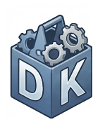
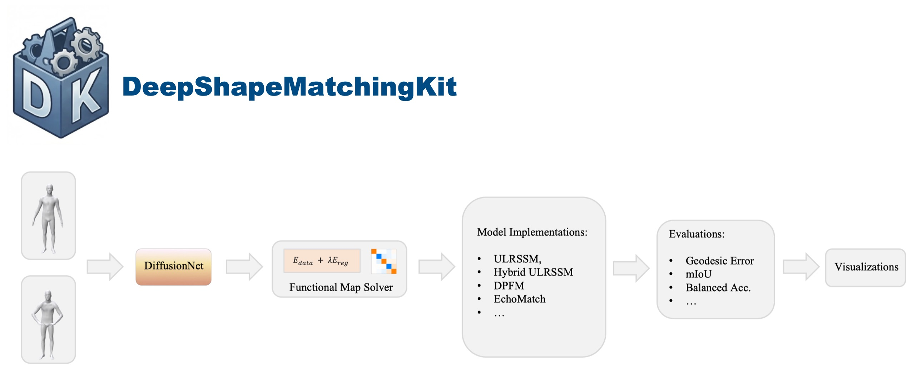

<b><font size="6">&nbsp;&nbsp;DeepShapeMatchingKit</font></b><br/>
<p>
&nbsp;&nbsp;&nbsp;<a href="..."></a>
<a href="LICENSE"></a>


</p>
<br clear="left"/>

<!-- --- -->

<p align="center">
  
</p>


DeepShapeMatchingKit provides a collection of deep shape matching methods with a few contributions to improve efficiency, understanding, and evaluation, including a **33× faster batched functional map solver**. More details are described in our [paper]().

This codebase is based on [ULRSSM](https://github.com/dongliangcao/Unsupervised-Learning-of-Robust-Spectral-Shape-Matching/) and includes implementations of:

| Method | Paper | Year | Original | Ours | Speedup (×) |
|--------|-------|------|----------|------|-------------|
| ULRSSM | [Cao et al.](https://github.com/dongliangcao/Unsupervised-Learning-of-Robust-Spectral-Shape-Matching/) | 2023 | 429 ms | **82 ms** | **5.23** |
| Hybrid ULRSSM | [Bastian et al.](https://github.com/xieyizheng/hybridfmaps) | 2024 | 555 ms | 363 ms | 1.53 |
| DPFM | [Attaiki et al.](https://github.com/pvnieo/DPFM/) | 2021 | 115 ms | **95 ms** | 1.21 |
| EchoMatch | [Xie et al.](https://github.com/vikiehm/echo-match) | 2025 | 215 ms | 195 ms | 1.10 |
| AttentiveFmaps 🔜 | [Li et al.](https://github.com/craigleili/AttentiveFMaps) | 2022 | 2050 ms | 448 ms | **4.57** |

<sub>Runtime measured per training iteration. AttentiveFmaps is not yet included in this repository; speedup was tested in the original implementation.</sub>

Contributions are welcome! Whether it's adding new methods, improving existing implementations, or fixing bugs — feel free to open an issue or submit a pull request.


## Installation
```bash
conda create -n deepshapematchingkit python=3.10
conda activate deepshapematchingkit
conda install -c nvidia cuda-toolkit # nvcc for complile pytorch3d with cuda support
pip install -r requirements.txt
```


<details>
<summary><strong>Shell-Energy</strong> (for Elastic Basis)</summary>

If you want to install the `shell-energy` library and its Python bindings, you can do so as follows:

```bash
git clone https://gitlab.com/numod/shell-energy.git
cd shell-energy
mkdir build
cd build
cmake -DBUILD_PYTHON=ON .. -DPython_EXECUTABLE=$(which python)
cmake --build . --config Release
cp python/pyshell.cpython*.so ../../
cd ../../
```

</details>


<details>
<summary><strong>PyTorch3D</strong> (for Diff3F Features)</summary>

```bash
pip install git+https://github.com/facebookresearch/pytorch3d.git@stable
```

PyTorch3D is required for computing DINO features using the [Diff3F](https://github.com/niladridutt/Diffusion-3D-Features) renderer. The installation can be tricky. If you run into installation issues, please check out the [installation guide](https://github.com/facebookresearch/pytorch3d/blob/main/INSTALL.md). 

<br/>

<strong>Optional</strong>: If you are using a cluster with mixed GPU types, you can specify all your GPU architectures to ensure compatibility, e.g.:
```bash
export TORCH_CUDA_ARCH_LIST="6.0;6.1;7.0;7.5;8.0;8.6+PTX" # much longer compile time
pip install git+https://github.com/facebookresearch/pytorch3d.git@stable 
```
</details>


## Datasets

To download and set up the datasets:
1. Run the following script [download_datasets.sh](download_datasets.sh) from the root directory to automatically download and place the datasets:
   ```bash
   bash download_datasets.sh
   ```
2. For the BeCoS dataset, please follow the official instructions at [BeCoS repository](https://github.com/NafieAmrani/becos-code) to manually download and generate the dataset.

All datasets placed under `../data/`
```Shell
├── data
    ├── ...
```
We thank the original dataset providers for their contributions to the shape analysis community, and that all credits should go to the original authors.

## Pre-trained Models

You can find all pre-trained models in [checkpoints](checkpoints/) and config files in [options](options/) for reproducibility.

In the following, we show how to run an experiment.


## Preprocess
```python
python preprocess.py --opt options/echo_match/train/echo_match_psmal_dino.yaml
```

Optional: `parallel_preprocess.py` with `worker_id` and `num_workers`.

## Train
```python
python train.py --opt options/echo_match/train/echo_match_psmal_dino.yaml
```
The experiments will be saved in [experiments](experiments) folder. You can visualize the training process in tensorboard or via wandb.
```bash
tensorboard --logdir experiments/
```

## Test
```python
python test.py --opt options/echo_match/test/echo_match_psmal_dino.yaml
```
The results will be saved in [results](results) folder.


## Visualization

Headless 
```python
python visualize.py --opt options/echo_match/test/echo_match_psmal_dino.yaml
```
Interactive
```python
python visualize.py -i --opt options/echo_match/test/echo_match_psmal_dino.yaml
```
The visualizations will be saved in [visualizations](visualizations) folder.


<p align="center">
  
</p>
<details>
<summary>Legacy visualization script for complete shape matching</summary>

```python
python visualize_complete.py --opt options/hybrid_ulrssm/test/smal.yaml
```

</details>
<!-- ## Pretrained models
You can find all pre-trained models in [checkpoints](checkpoints) for reproducibility. -->

## Acknowledgement
The framework implementation is adapted from [Unsupervised Learning of Robust Spectral Shape Matching](https://github.com/dongliangcao/Unsupervised-Learning-of-Robust-Spectral-Shape-Matching/).

The implementation of DiffusionNet is based on [the official implementation](https://github.com/nmwsharp/diffusion-net).

The implementation of visualization is based on [polyscope](https://github.com/nmwsharp/polyscope-py).

We thank the original authors for their contributions to this code base.

<!-- : [Nickolas Sharp](https://github.com/nmwsharp/), [Florine Hartwig](https://github.com/flrneha) and [Dongliang Cao](https://github.com/dongliangcao), -->

## Citation
If you find this codebase useful, please cite:
```
preprint to be released
```

Please also consider citing the original papers:
```
@article{cao2023unsupervised,
  title={Unsupervised Learning of Robust Spectral Shape Matching},
  author={Cao, Dongliang and Roetzer, Paul and Bernard, Florian},
  journal={ACM Transactions on Graphics (TOG)},
  volume={42},
  number={4},
  pages={1--15},
  year={2023},
  publisher={ACM New York, NY, USA}
}
@inproceedings{bastian2024hybrid,
  title={Hybrid Functional Maps for Crease-Aware Non-Isometric Shape Matching},
  author={Bastian, Lennart and Xie, Yizheng and Navab, Nassir and L{\"a}hner, Zorah},
  booktitle={Proceedings of the IEEE/CVF Conference on Computer Vision and Pattern Recognition (CVPR)},
  pages={3313--3323},
  month={June},
  year={2024}
}
@inproceedings{attaiki2021dpfm,
  title={Dpfm: Deep partial functional maps},
  author={Attaiki, Souhaib and Pai, Gautam and Ovsjanikov, Maks},
  booktitle={2021 International Conference on 3D Vision (3DV)},
  pages={175--185},
  year={2021},
  organization={IEEE}
}
@inproceedings{xie2025echomatch,
  title={EchoMatch: Partial-to-Partial Shape Matching via Correspondence Reflection},
  author={Xie, Yizheng and Ehm, Viktoria and Roetzer, Paul and El Amrani, Nafie and Gao, Maolin and Bernard, Florian and Cremers, Daniel},
  booktitle={Proceedings of the Computer Vision and Pattern Recognition Conference},
  pages={11665--11675},
  year={2025}
}

```
<!-- And my master's thesis:
```
bibtex to be added
``` -->